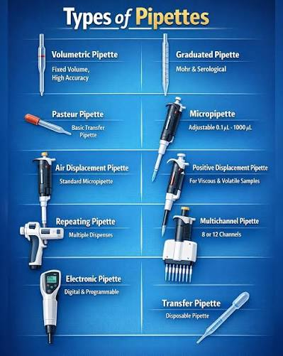
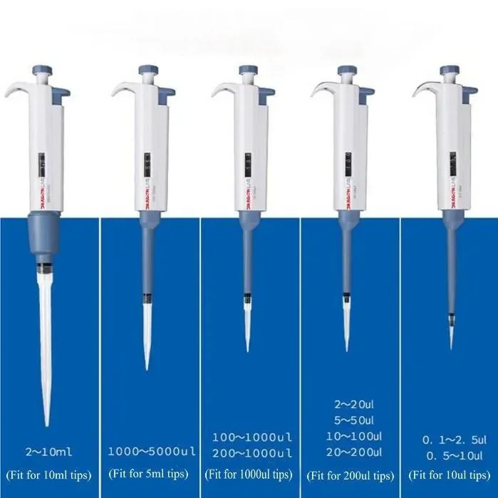
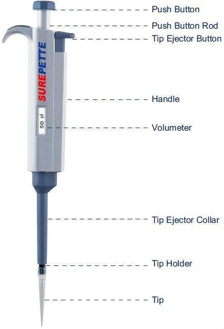

# Mikropipet dan Pipetting

<!-- 
Poin-poin bagian ini:

1. Apa itu pipet
2. Apa saja jenis pipet
-->

Pipet adalah alat untuk memindahkan/mengambil cairan pada volume yang tepat.
Pipetting merupakan salah satu teknik yang menentukan keberhasilan suatu penelitian, karena penelitian memerlukan pengambilan volume cairan secara tepat sesuai prosedur yang diinginkan. 

Untuk meningkatkan akurasi, ujung pipet dicelupkan tepat di bawah cairan pada posisi tegak lurus (±90°) dan hindari udara masuk ke ujung pipet. 
Hindari mencelupkan ujung pipet terlalu dalam, karena dapat meningkatkan volume cairan, sedangkan mencelupkan ujung pipet terlalu dekat dengan permukaan cairan menyebabkan aspirasi udara ke dalam pipet sehingga menghasilkan volume yang tidak akurat.  

Tiap-tiap bagian akan menjelaskan tentang komponen (anatomi) pipet, prosedur penggunaan, dan cara merawatnya. sub-bagian yang disebutkan terakhir penting bagi laboran ataupun pemelihara alat.

:::{tip} Untuk Pengajar
:class: dropdown

Silahkan pergi menuju [dokumen ini untuk cara mengajarinya](pipetting-teach.ipynb)
:::

## Mikropipet

Mikropipet adalah alat untuk memindahkan/mengambil cairan yang bervolume cukup kecil, biasanya kurang dari 1000 μl.
Penelitian di bidang bioteknologi kelautan tidak lepas dari alat laboratorium berupa mikropipet.

Mikropipet memiliki ukuran-ukuran tertentu.

 

Teknik penggunaan mikropipet dibagi menjadi dua, yaitu
pipet maju (forward pipetting sequence) dan pipet terbalik (reverse pipetting
sequence).

Forward pipetting sequence dilakukan dengan menekan tombol
pendorong perlahan hingga berhenti pertama untuk mengambil cairan, tarik
pendorong secara bertahap dan hati-hati untuk mencegah masuknya udara,
lalu tekan pendorong di dalam tabung tujuan hingga berhenti kedua untuk
mengeluarkan seluruh volume dari ujungnya. Teknik ini cocok digunakan
pada cairan yang encer. 

Sebaliknya, reverse pipetting sequence dilakukan dengan
menekan tombol pendorong perlahan hingga berhenti kedua sebelum
mengambil cairan, tarik pendorong secara bertahap dan hati-hati untuk
mencegah masuknya udara, lalu tekan pendorong di dalam tabung tujuan
hingga berhenti pertama untuk mengeluarkan seluruh volume dari ujungnya.
Teknik ini cocok untuk cairan yang kental maupun berbusa

### Anatomi mikropipet

1. _Plunger button_: bagian ini bergerak ke atas saat dilepas dan ke bawah saat ditekan, berfungsi untuk mengambil dan mengeluarkan cairan. 
2. _Tip ejector button_: berfungsi untuk mendorong atau melepaskan tip dari mikropipet 
3. _Volume indicator / Volumeter_: menunjukkan jumlah cairan yang akan dipipet 
4. _Volume adjusment knob_: bagian untuk mengatur besar kecilnya volume cairan. 
5. _Tip attachment_: Ujung bawah mikropipet, bagian untuk menempelkan tip 
6. _Plastik tip_: bagian terpisah dari mikropipet yang langsung bersentuhan dengan cairan, menampung cairan sesuai volume yang diatur, dan ukurannya disesuaikan dengan kapasitas mikropipet. 

### Prosedur Penggunaan

Sebelum digunakan, plunger button sebaiknya ditekan berkali-kali untuk memastikan lancarnya mikropipet. 

Berikut di bawah ini adalah **prosedur penggunaan forward pipetting sequence**:

1. Atur volumeter menggunakan _volume adjustment knob_
2. Masukkan tip bersih ke dalam _tip attachment_. 
3. Tekan plunger button sampai hambatan pertama / first stop, jangan ditekan lebih ke dalam lagi. 
4. Masukkan tip ke dalam cairan sedalam 3-4 mm (tidak terlalu dalam maupun terlalu dekat dengan permukaan cairan). 
5. Tahan pipet dalam posisi vertikal (±90°) kemudian lepaskan tekanan dari plunger button maka cairan akan masuk ke tip. 
6. Pindahkan ujung tip ke tempat penampung yang diinginkan. 
7. Tekan plunger button sampai hambatan kedua / second stop atau tekan semaksimal mungkin maka semua cairan akan keluar dari ujung tip. 
8. Lepas tip setelah digunakan dengan menekan tombol Tip eject button. 
9. Apabila mikropipet sudah digunakan, kembalikan volumeter menjadi volume terbesar di rentang tersebut

Berikut adalah video yang bisa ditonton untuk prosedur pemakaian mikropipet, khususnya merek DragonLab: <https://www.youtube.com/watch?v=QNquSEKOl08>, dengan stempel waktu dari 00:00 - 02:00 [@dlabscientificinc.PipetteBasicsForward2026].

#### Beberapa Reka Guna (Use Case)

Dari prosedur yang disebut, ada beberapa aspek yang bisa dipertanyakan dalam satu rentetan pemakaian, yaitu:

- Volume
- Cairan 

### Pemeliharaan

## Pipet Volumetrik

### Prosedur Penggunaan

Pilih pipet ukur sesuai volume yang dibutuhkan. 

1. Pasang filler pada pangkal pipet ukur dengan kuat agar tidak bocor. 
2. Pastikan pipet dan filler bersih serta kering sebelum digunakan. 
3. Tekan katup A (aspirate) pada filler untuk mengeluarkan udara. 
4. Celupan ujung pipet ke dalam cairan yang akan diambil. 
5. Tekan katup S (suction) agar cairan tersedot ke dalam pipet hingga melewati tanda skala volume yang diinginkan. 
6. Atur volume dengan cara sejajarkan meniskus cairan dengan garis skala. 
7. Arahkan ujung pipet ke wadah tujuan, lalu tekan katup E (exhaust) untuk mengeluarkan cairan dari pipet, pastikan cairan keluar tanpa gelembung udara. 
8. Lepas filler dari pipet dan bersihkan pipet. 

