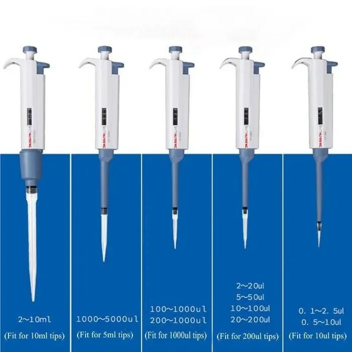

# Mikropipet dan Pipetting

<!-- 
Poin-poin bagian ini:

1. Apa itu pipet
2. Apa saja jenis pipet
-->

Pipet adalah alat untuk memindahkan/mengambil cairan pada volume yang tepat.
Pipetting merupakan salah satu teknik yang menentukan keberhasilan suatu penelitian, karena penelitian memerlukan pengambilan volume cairan secara tepat sesuai prosedur yang diinginkan. 

Untuk meningkatkan akurasi, ujung pipet dicelupkan tepat di bawah cairan pada posisi tegak lurus (±90°) dan hindari udara masuk ke ujung pipet. 
Hindari mencelupkan ujung pipet terlalu dalam, karena dapat meningkatkan volume cairan, sedangkan mencelupkan ujung pipet terlalu dekat dengan permukaan cairan menyebabkan aspirasi udara ke dalam pipet sehingga menghasilkan volume yang tidak akurat.  

Tiap-tiap bagian akan menjelaskan tentang komponen (anatomi) pipet, prosedur penggunaan, dan cara merawatnya. sub-bagian yang disebutkan terakhir penting bagi laboran ataupun pemelihara alat.

## Mikropipet

Mikropipet adalah alat untuk memindahkan/mengambil cairan yang bervolume cukup kecil, biasanya kurang dari 1000 μl.
Penelitian di bidang bioteknologi kelautan tidak lepas dari alat laboratorium berupa mikropipet.

 

### Anatomi mikropipet

1. _Plunger button_: bagian ini bergerak ke atas saat dilepas dan ke bawah saat ditekan, berfungsi untuk mengambil dan mengeluarkan cairan. 
2. _Tip ejector button_: berfungsi untuk mendorong atau melepaskan tip dari mikropipet 
3. _Volume indicator_: menunjukkan jumlah cairan yang akan dipipet 
4. _Volume adjusment_: bagian untuk mengatur besar kecilnya volume cairan. 
5. _Tip attachment_: bagian untuk menempelkan tip 
6. _Plastik tip_: bagian terpisah dari mikropipet yang langsung bersentuhan dengan cairan, menampung cairan sesuai volume yang diatur, dan ukurannya disesuaikan dengan kapasitas mikropipet. 

### Prosedur Penggunaan

Sebelum digunakan, plunger button sebaiknya ditekan berkali-kali untuk memastikan lancarnya mikropipet. 

1. Masukkan tip bersih ke dalam tip attachment / ujung mikropipet. 
2. Tekan plunger button sampai hambatan pertama / first stop, jangan ditekan lebih ke dalam lagi. 
3. Masukkan tip ke dalam cairan sedalam 3-4 mm (tidak terlalu dalam maupun terlalu dekat dengan permukaan cairan). 
4. Tahan pipet dalam posisi vertikal (±90°) kemudian lepaskan tekanan dari plunger button maka cairan akan masuk ke tip. 
5. Pindahkan ujung tip ke tempat penampung yang diinginkan. 
6. Tekan plunger button sampai hambatan kedua / second stop atau tekan semaksimal mungkin maka semua cairan akan keluar dari ujung tip. 
7. Lepas tip setelah digunakan dengan menekan tombol Tip eject button. 

Berikut adalah video yang bisa ditonton untuk prosedur pemakaian mikropipet, khususnya merek DragonLab: <https://www.youtube.com/watch?v=QNquSEKOl08>, dengan stempel waktu dari 00:00 - 02:00 [@dlabscientificinc.PipetteBasicsForward2026].

### Pemeliharaan

## Pipet Volumetrik
